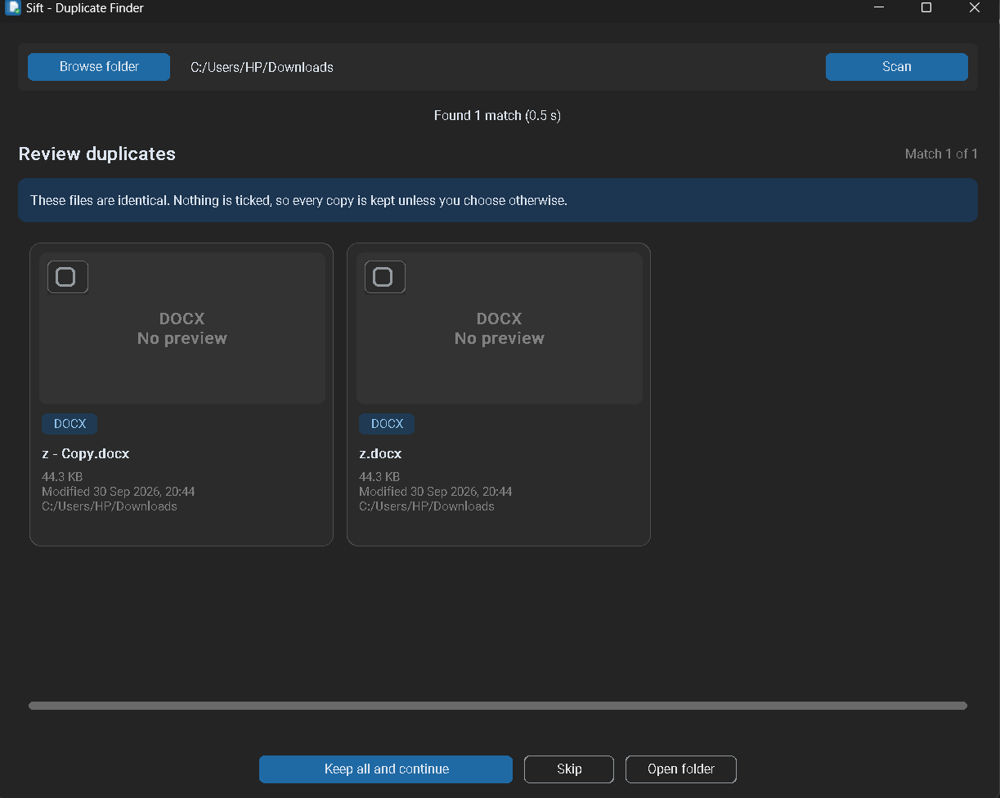
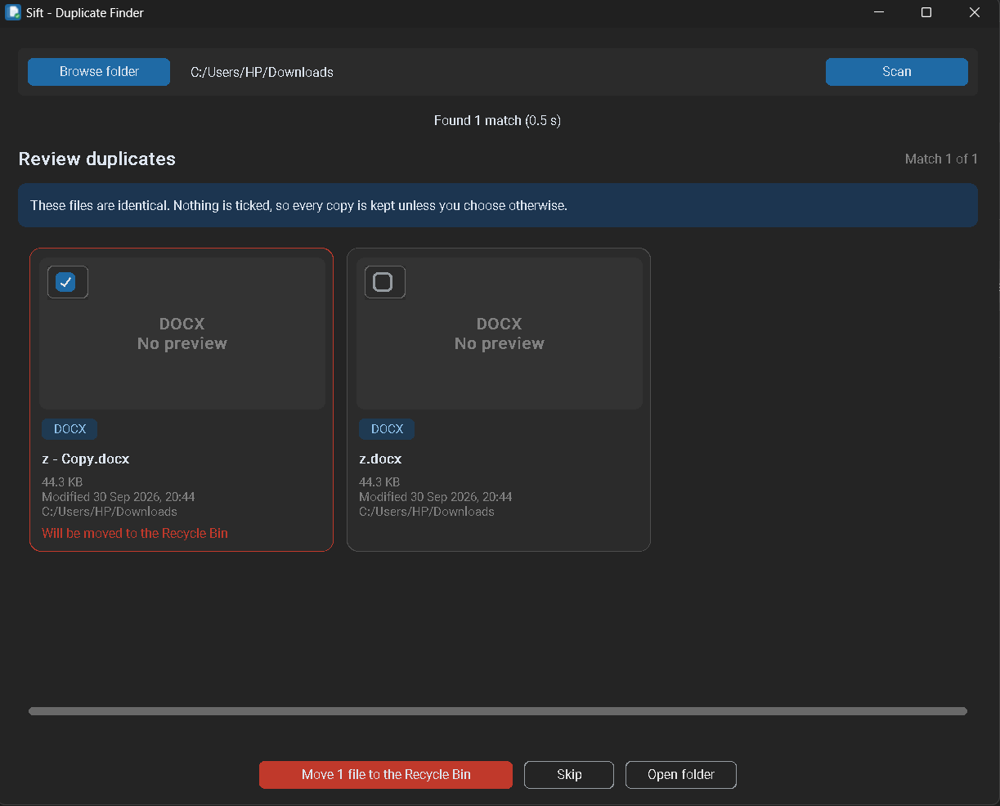
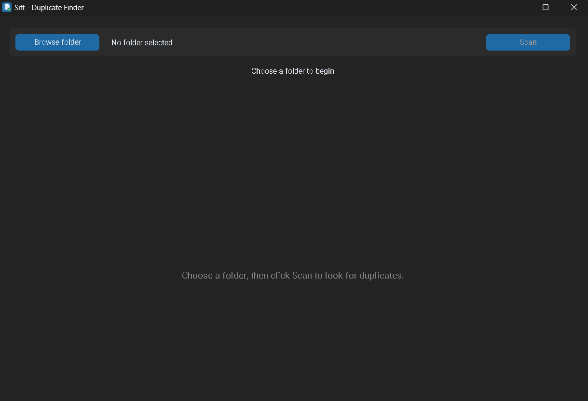

# Sift - Duplicate File Finder

Sift finds duplicate files on Windows and lets you review them side by side before anything is removed.

<p align="center">
  
  
  
</p>

## What it does

- Scans a folder and all its subfolders for files with identical content, whatever they are named
- Shows each set of duplicates as side-by-side cards, with a preview for pictures
- You choose what to remove with a checkbox on each file. Nothing is ticked by default
- Removed files go to the Recycle Bin, so you can restore them
- At least one copy of every file always stays. Sift will not let you remove them all

## Download

Get the latest installer from the [Releases page](https://github.com/bellojoshua286-bit/sift/releases/latest), then run `SiftSetup-x.y.z.exe`.

Requires Windows 10 or later. Sift installs for your own user account and does not need administrator rights.

### Windows and antivirus warnings

Sift is not code-signed yet, so Windows SmartScreen may show a "Windows protected your PC" screen. Click **More info**, then **Run anyway**.

Some antivirus programs also flag newly released apps, especially ones packaged with PyInstaller, even when they are harmless (a "false positive"). Please do not turn your antivirus off. If it blocks or removes Sift, restore it from quarantine and add the Sift folder (`%LOCALAPPDATA%\Programs\Sift`) to your antivirus exclusions. Only do this if you downloaded Sift from this repository's Releases page and the checksum matches.

## Is Sift safe?

You do not have to take our word for it:

- **Read the code.** All of Sift's source code is in this repository.
- **No internet.** Sift contains no network code. It does not send your files or any other data anywhere.
- **You stay in control.** Sift only removes files you tick yourself and confirm, and they go to the Recycle Bin.
- **Check your download.** Each release lists a SHA-256 checksum. After downloading, open Command Prompt in your Downloads folder and run `certutil -hashfile SiftSetup-1.0.0.exe SHA256`. The result must match the one in the release notes.
- **Virus scan.** Each release links to a VirusTotal scan report.

## How it finds duplicates

1. Files are grouped by size, because files of different sizes can never be identical
2. Files of the same size are compared by a fingerprint of their first 64 KB
3. Remaining matches are confirmed by a fingerprint of the whole file (BLAKE2)

File names are never used to decide that two files are identical. Empty files, hidden and system files, and Office temporary files (names starting with `~$`) are skipped.

## Privacy

Sift runs entirely on your computer. It does not connect to the internet or collect any data.

## Run from source

Built with Python 3.13.

```
git clone https://github.com/bellojoshua286-bit/sift.git
cd sift
python -m venv venv
venv\Scripts\python -m pip install -r requirements.txt
venv\Scripts\python app.py
```

Run the tests:

```
venv\Scripts\python -m pytest
```

## Build the app and installer

```
venv\Scripts\python -m PyInstaller --clean --onefile --windowed --name Sift --icon app_icon.ico --add-data "app_icon.ico;." --version-file version_info.txt --collect-all customtkinter app.py
```

Then open `sift_setup.iss` in [Inno Setup](https://jrsoftware.org/isinfo.php) and compile it. The installer is created in the `installer` folder.

## Roadmap

- Similar-image detection, for example a RAW file and its JPEG, using the same side-by-side review

## License

MIT. See the `LICENSE` file.